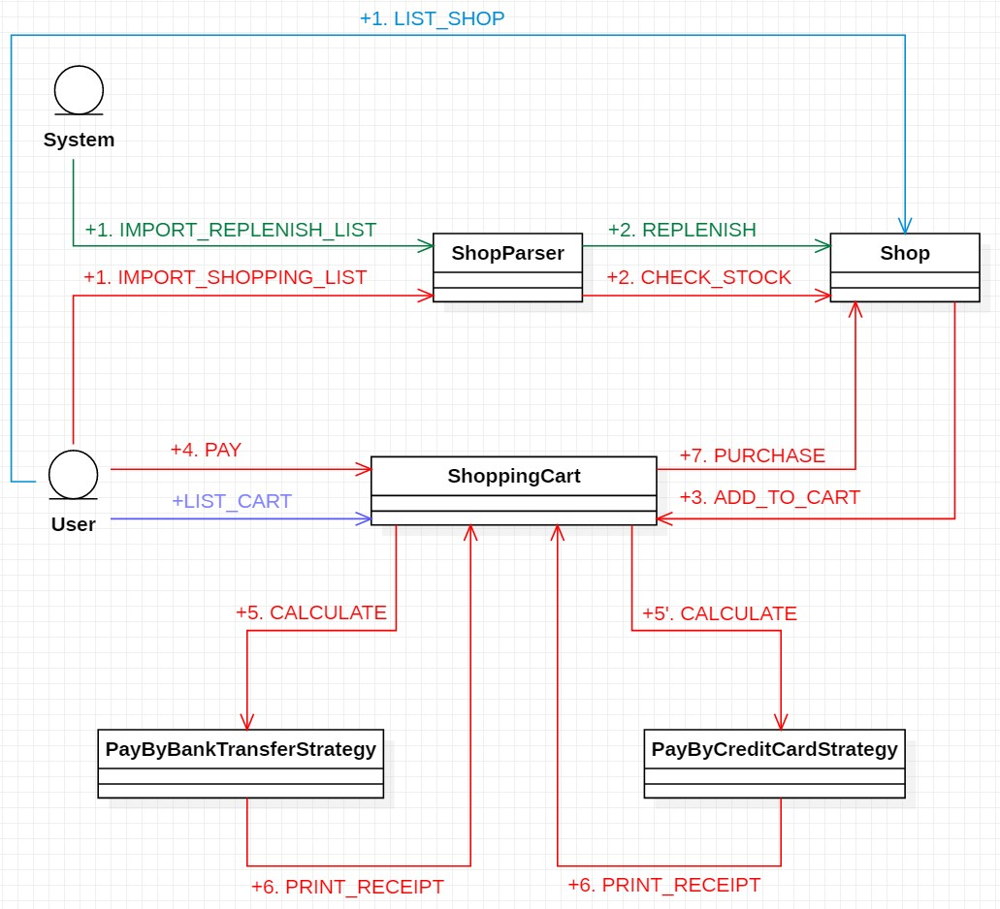

# Design Patterns 2021 Spring Assignment

## Assignment 8

__Deadline__: 6/15 23:59.

Here's the
[template code](https://ssl-gitlab.csie.ntut.edu.tw/course/dp2021s_hw_template)
of this assignment, please clone this repo and __DELETE THE FOLDER `.git` AND
FOLLOW THIS TEMPLATE TO COMPLETE YOUR HW__. This template is just the skeleton.
You should finish implementation by yourself.

For this assignment, you are supposed to complete the Shop problem and add some
**discount** and **payment method** features on it with **Decorator Pattern**
and **Strategy Pattern**

Please complete the given code to satisfy all the specs of the Shop problem and
the following conditions.

- interface `Decorator`, which is the base class for decorator.
- class `RateDiscountDecorator`, which should decorate `Goods` with rate 
  discount.
- class `FixedDiscountDecorator`, which should decorate `Goods` with fixed     
  discount.
---
- interface `PayStrategy`, which can calculate the total price with different 
  strategy.
- class `PayByBankTransferStrategy` and `PayByCreditCardStrategy`, both of which
  implement `PayStrategy`.
- class `PayByBankTransferStrategy`, which represent the payment strategy of pay
  by bank transfer. If user choose this strategy, there will be 0.49 handling fee
  per transfer.
- class `PayByCreditCardStrategy`, which represent the payment strategy of pay
  by credit card. If user choose this strategy, there will be 10% off discount 
  for the deal.
---
- class `InstructionHandler`, which helps you to 
  - list all the goods that the shop has
  - import your shopping list into the shopping cart
  - check the content of your shopping cart
  - go to pay
---
  - please follow the rules below:

    


## Notes
- Use `System.out.print()` instead of `System.out.println()`.
- `input/replenish_list.json` should be hardcoded in `Main`.
- You can assume that the format of the imported lists are correct.
- You have to clear all the items in the shopping cart after payment success.
- You should follow [sample instructions](./hw8_sample_instructions.md) to complete
  the context.
- The format of Goods objects is `%-4s%-22s%-40s%-8s%-6s\n` when listing the 
  items in the shop or in the shopping cart.
- The format of Goods objects is `%-40s%-10s%-10s\n` when issuing a receipt.
- Please don't close the scanner if you use it to read `System.in`, or you can't
  reopen it.
  
## Grading Rubrics
- Complete lab2: 40%
- Decorator Pattern: 25%
- Strategy Pattern: 25%
- Main: 10%
- Test for Composite pattern, Iterator pattern, etc: 10% bonus

## File Structure
  ```bash
  .
  ├── README.md
  ├── input
  │   ├── replenish_list.json
  │   └── shopping_list.json
  ├── pom.xml
  ├── sample_output.md
  └── src
      ├── main
      │   └── java
      │       └── org
      │           └── ntutssl
      │               └── shop
      │                   ├── Collection.java
      │                   ├── Decorator.java                         **new**
      │                   ├── Event.java
      │                   ├── EventListener.java
      │                   ├── EventManager.java
      │                   ├── EventType.java
      │                   ├── FixedDiscountDecorator.java            **new**
      │                   ├── Goods.java
      │                   ├── GoodsBuilder.java
      │                   ├── GoodsEvent.java
      │                   ├── GoodsParser.java
      │                   ├── InstructionHandler.java                **new**
      │                   ├── Main.java
      │                   ├── Merchandise.java
      │                   ├── NullIterator.java
      │                   ├── PayByBankTransferStrategy.java         **new**
      │                   ├── PayByCreditCardStrategy.java           **new**
      │                   ├── PayStrategy.java                       **new**
      │                   ├── RateDiscountDecorator.java             **new**
      │                   ├── Shop.java
      │                   ├── ShopException.java
      │                   ├── ShoppingCart.java
      │                   └── StringEvent.java
      └── test
          └── java
              └── org
                  └── ntutssl
                      └── shop
                          ├── CollectionTest.java                    (bonus)
                          ├── EventManagerTest.java                  (bonus)
                          ├── EventTest.java                         (bonus)
                          ├── FixedDiscountDecoratorTest.java        **new**
                          ├── GoodsBuilderTest.java
                          ├── GoodsParserTest.java
                          ├── MerchandiseTest.java                   (bonus)
                          ├── PayByBankTransferStrategyTest.java     **new**
                          ├── PayByCreditCardStrategyTest.java       **new**
                          ├── RateDiscountDecoratorTest.java         **new**
                          ├── ShopTest.java
                          └── ShoppingCartTest.java
  ```

## References
- [Oracle Java Document](https://docs.oracle.com/en/java/javase/15/docs/api/index.html)
- [Strategy Pattern in Java](https://www.baeldung.com/java-strategy-pattern)
- [Decorator Pattern in Java](https://www.baeldung.com/java-decorator-pattern)